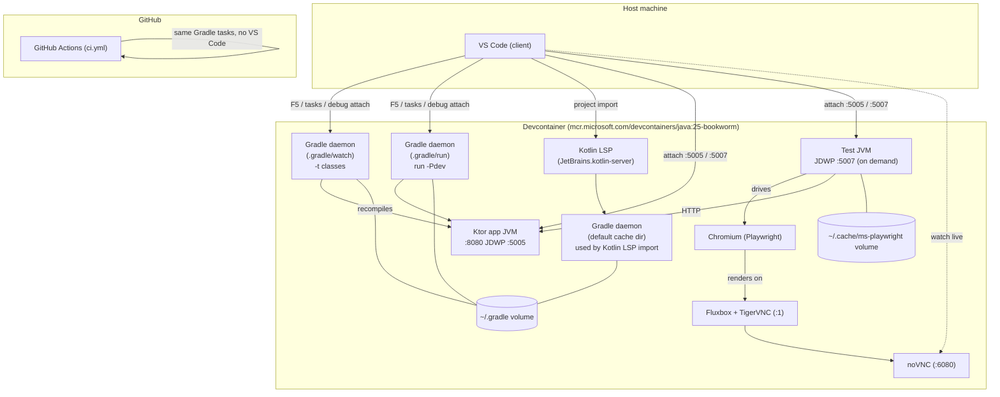
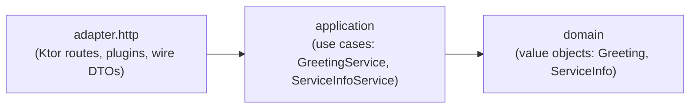
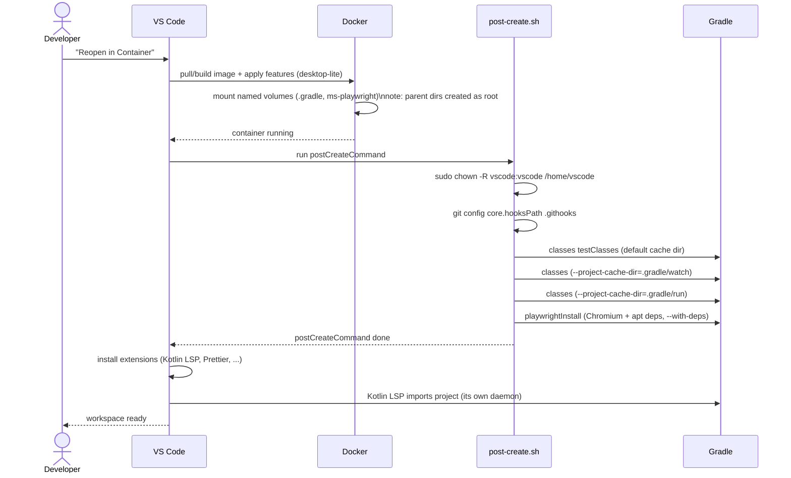
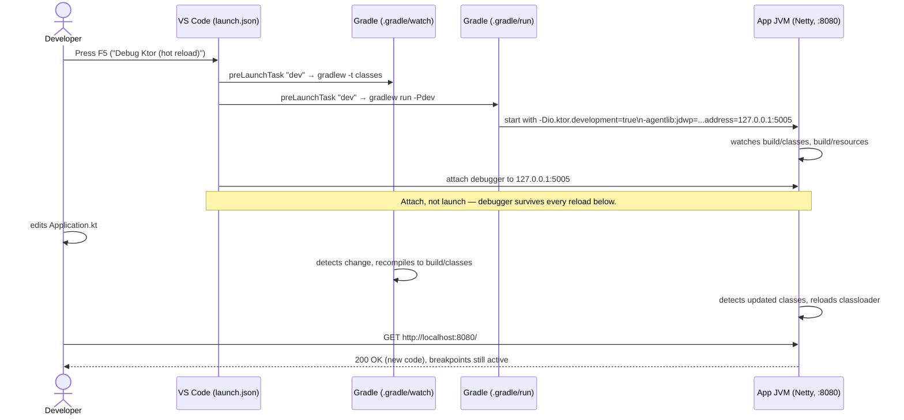
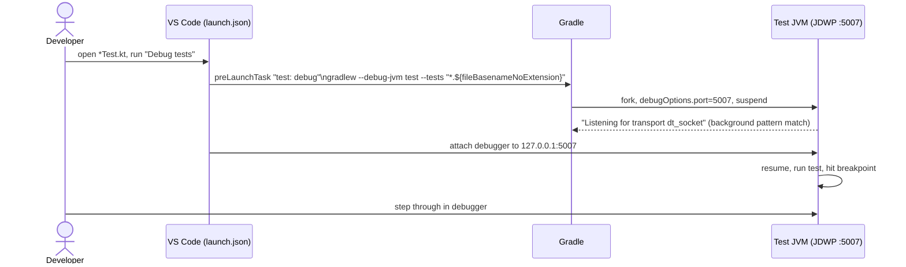
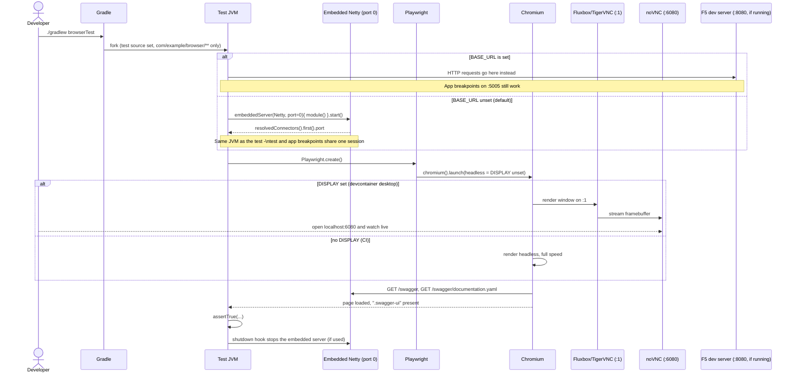
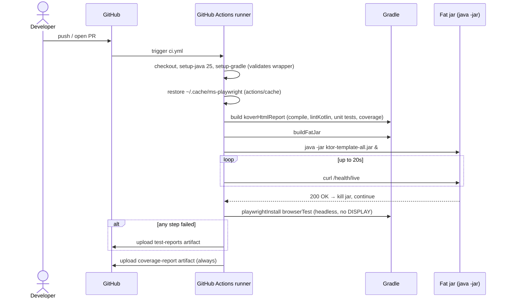
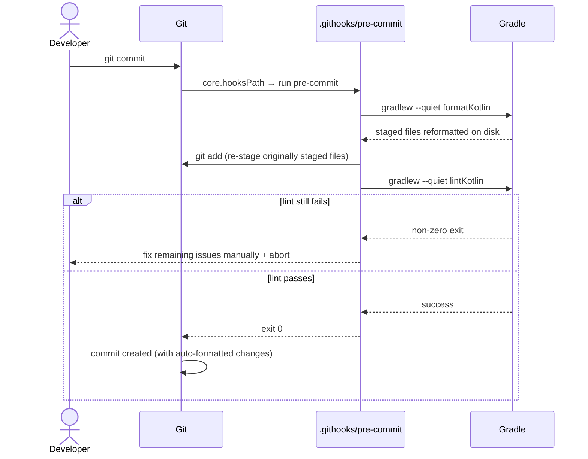

# Architecture

This is a Kotlin/Ktor service template built to be productive **the second you open it** in
VS Code: hot reload, an always-attached debugger, black-box tests with a watchable browser,
and a devcontainer that provisions all of it. This document maps every moving part and how
they talk to each other.

## Component inventory

| Component                       | File(s)                                                                                           | Responsibility                                                                                                                                                                                                                    |
| ------------------------------- | ------------------------------------------------------------------------------------------------- | --------------------------------------------------------------------------------------------------------------------------------------------------------------------------------------------------------------------------------- |
| **Devcontainer**                | `.devcontainer/devcontainer.json`, `post-create.sh`                                               | Defines the container image, features, mounts, ports; runs one-time setup                                                                                                                                                         |
| **`desktop-lite` feature**      | `devcontainer.json` → `features`                                                                  | Fluxbox + TigerVNC + noVNC, gives the container a real `DISPLAY` and a browser-viewable desktop on `:6080`                                                                                                                        |
| **Kotlin LSP**                  | `JetBrains.kotlin-server` extension                                                               | Language server: completion, diagnostics, formatting, refactoring. Imports the project via its own Gradle sync                                                                                                                    |
| **Gradle**                      | `build.gradle.kts`, `settings.gradle.kts`, `gradle.properties`, `gradle/libs.versions.toml`       | Build tool: compiles Kotlin, runs tests, packages the app, drives Kover/ktlint                                                                                                                                                    |
| **Ktor application**            | `src/main/kotlin/com/example/domain/*`, `application/*`, `adapter/http/*`, `src/main/resources/*` | The actual service, split hexagonally: `domain` (value objects), `application` (use cases), `adapter.http` (Ktor routing/plugins). Both HTTP modules are declared by name in `application.yaml`, proving that wiring path is real |
| **VS Code tasks**               | `.vscode/tasks.json`                                                                              | Wraps Gradle invocations as named, chainable, backgroundable commands                                                                                                                                                             |
| **VS Code launch configs**      | `.vscode/launch.json`                                                                             | Attaches the JVM debugger to a task's JDWP port instead of launching the JVM itself                                                                                                                                               |
| **unit / arch / browser tests** | `src/test/kotlin/com/example/unit/*`, `.../arch/*`, `.../browser/*`                               | In-process and Konsist architecture tests run with `test`; Playwright HTTP and browser scenarios run with `browserTest`                                                                                                           |
| **Pre-commit hook**             | `.githooks/pre-commit`                                                                            | Auto-formats staged Kotlin with `formatKotlin`, then blocks commits that still fail `lintKotlin`                                                                                                                                  |
| **CI**                          | `.github/workflows/ci.yml`                                                                        | Same checks as local, plus a packaged-jar smoke test, on every push/PR                                                                                                                                                            |

## Component map

## Code layering: hexagonal architecture + DDD

`src/main/kotlin/com/example` is split into three packages, each only allowed to depend
inward, enforced by `src/test/kotlin/com/example/arch/HexagonalArchitectureTest.kt` (Konsist)
on every `test` run rather than left as unchecked convention:

- **`domain`** — plain data classes with zero framework imports (no `@Serializable`, no Ktor).
  This is the DDD tactical layer: today just small value objects, but it's where
  entities/aggregates/domain events would live if the template grew real business rules.
- **`application`** — use case classes that orchestrate the domain. Also framework-free; an
  adapter (HTTP today, a CLI or message consumer tomorrow) calls into these, never the other
  way round.
- **`adapter.http`** — the only package allowed to import Ktor. Routes call an application
  service and map its domain return value to a `@Serializable` response DTO, so the domain
  model never leaks into the wire format (and vice versa).
- There are no outbound adapters yet (no persistence — see "No database, no Testcontainers"
  below). When one is needed, add `adapter.<technology>` alongside `adapter.http` and, if the
  application layer needs to call it, a port interface in `application` that the new adapter
  implements.

## Use case: opening the devcontainer for the first time

The whole-home `chown` exists because Docker creates the _parent_ of a volume mount
(`~/.cache`) as root the first time, which silently broke Kotlin LSP's own cache the first
time this template added the Playwright volume — see `AGENTS.md` / commit history for that
regression. Chowning everything instead of enumerating mount points avoids repeating it.

## Use case: F5 — hot reload with an always-attached debugger

## Use case: debugging a single test

Port 5007 is deliberate: Gradle's own `--debug-jvm` defaults to 5005, which would collide
with the app JVM's debug port from the previous use case.

## Use case: black-box (e2e) tests + the live browser view

Playwright HTTP and browser e2e tests run separately with `browserTest`.
target either the already-running F5 dev server or a server started in the test JVM, decided by
`BASE_URL`.

If a headed launch fails (stale `DISPLAY`, desktop not up yet), `SwaggerUiBrowserTest` catches
it and retries headless rather than failing the whole test.

## Use case: CI pipeline

## Use case: committing

`core.hooksPath` is set once by `post-create.sh`, so this works the same for anyone who
opens the devcontainer — no separate hook manager dependency.

## Key design decisions (see `AGENTS.md` for the full list)

- **Attach, don't launch**: both debugger configs attach to a JDWP port opened by a Gradle
  task, so the debugger session outlives hot reloads and test re-runs.
- **Three separate debug ports** (5005 app, 5007 tests) and **three Gradle cache dirs**
  (default, `.gradle/watch`, `.gradle/run`) exist purely to stop the dev loop, the test
  runner, and the Kotlin LSP's own project import from fighting each other over the same
  lock or port.
- **Browser tests are excluded by package, not by source set or `@Tag`** (`test` excludes
  `com/example/browser/**`, `browserTest` includes only it) — kept off `check`/`build` so a
  normal build never needs a browser.
- **No database, no Testcontainers**: this template intentionally stays infrastructure-free;
  add a `Fixtures` seam (see `AGENTS.md`) before adding either.
- **Hexagonal layering is enforced by a test, not just convention**: `HexagonalArchitectureTest`
  (Konsist) fails the build if `domain`/`application` ever import Ktor or an outer layer, so the
  boundary survives contributors who haven't read this document.
